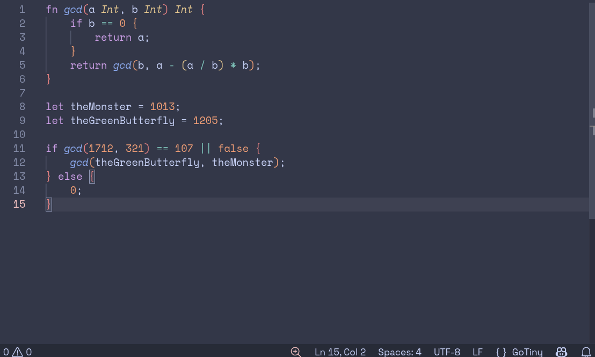

# GoTiny Language Support

VS Code language support for GoTiny, a tiny statically-typed programming language implemented in Go.

## Screenshots

| Catppuccin Frappé                                                                    | Gruvbox Material Dark                                                                         |
| ------------------------------------------------------------------------------------ | --------------------------------------------------------------------------------------------- |
|  |  |

## Features

- Syntax highlighting for GoTiny source files
- `.gt` file association
- GoTiny keywords and control flow
- Type highlighting for Int and Bool
- Boolean literals
- Function declarations and calls
- Integer literals
- Operators
- Variable highlighting

## Installation

### From Source

Clone the repository inside the `<user home>/.vscode/extensions` folder and restart Code

```
git clone https://github.com/shsiddhant/gotiny-language-support.git
```

## Development

The extension currently uses a TextMate grammar for syntax highlighting.

The syntax grammar is located at: `syntaxes/gotiny.tmLanguage.json`

Language configuration is located at: `language-configuration.json`

Status
This extension is currently focused on syntax highlighting and basic language configuration.

Future language tooling may include features such as diagnostics, completion, and other editor support.

## Related Project

GoTiny: https://github.com/shsiddhant/gotiny
