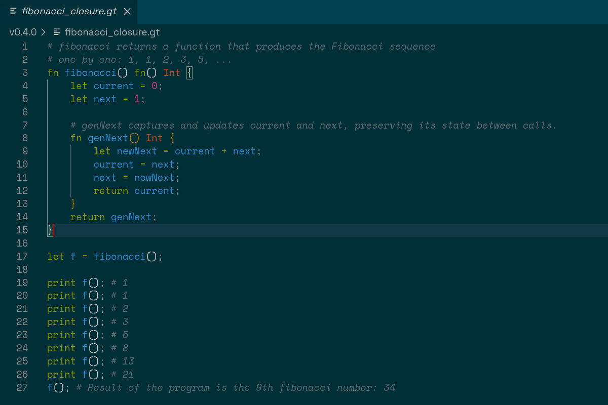
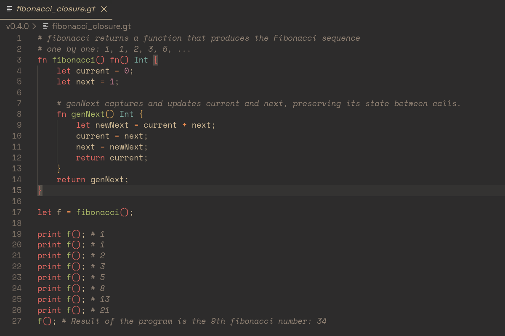

# GoTiny Language Support

VS Code language support for [GoTiny](https://github.com/shsiddhant/gotiny),
a tiny statically-typed programming language implemented in Go.

**Supports GoTiny v0.4.2**

## Screenshots

| Solarized Dark                                                                    | Gruvbox Material Dark                                                                         |
| ------------------------------------------------------------------------------------ | --------------------------------------------------------------------------------------------- |
|  |  |

## Features

- Syntax highlighting for GoTiny keywords, types, literals, operators, variables, and comments
- `.gt` file association
- Ctrl+/ to toggle comments

## Installation

Clone the repository inside the `<user home>/.vscode/extensions` folder and restart VS Code:

```
git clone https://github.com/shsiddhant/gotiny-language-support.git
```

## Development

The extension currently uses a TextMate grammar for syntax highlighting.

The syntax grammar is located at: `syntaxes/gotiny.tmLanguage.json`

Language configuration is located at: `language-configuration.json`

## Related Project

[GoTiny](https://github.com/shsiddhant/gotiny)
